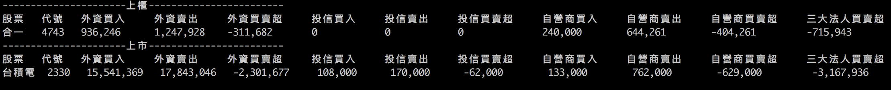

# EzStock
you can crawl tpex and twse daily trade by one line

##Requirement

### Python 3.6+
install from official site

### pip
```sudo easy_install pip```

### scrapy
- ```pip3 install scrapy```  
- ```set scrapy path to bash_profile```

##Scrapy it
1. add stock_list.json file with stock code eq. ```["1234", "5678"] ```

2. in terminal and execute ```scrapy runspider spider_name --nolog```

3. 